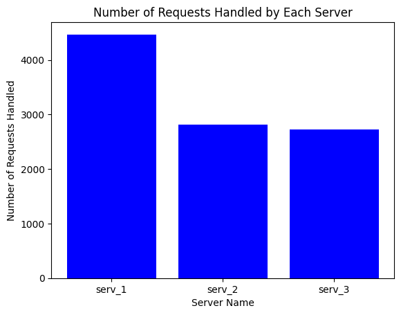
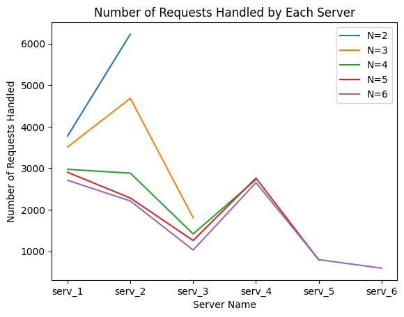
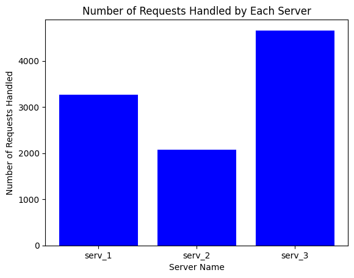
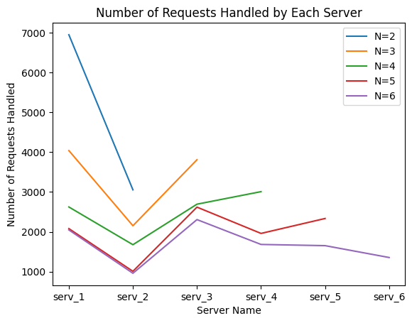

# Distributed Systems Assignment 1
## Server
- Server has 2 endpoints viz., `Endpoint (/home, method=GET)` and `Endpoint (/heartbeat, method=GET)`.
- Each Server runs in a container with a unique IP address and port number as 8080. (This information is hidden from the client)

## Loadbalancer
- Loadbalancer works with both the client and server which redirects the requests from client to server.
- It runs on the port 5000.
- It sends and recieves heartbeats to keep track of which servers are up and which servers have crashed
- It also maintains the number of servers consistent and if any server goes down, it will spawn a new server and add it to the list of servers.
- It forwards the requests using the **consistent hashing** algorithm.
    - There is a circular array with 512 slots which stores the information of servers
    - Hash functions are utilized to map server to a slot in the cirular array and map request to a server
    - Virtual servers are used to make the requests get distributed evenly among all the servers 
- This has the following endpoints:
    - `Endpoint (/rep, method=GET)`
    - `Endpoint (/add, method=POST)`
    - `Endpoint (/rm, method=DELETE)`
    - `Endpoint (/<path>, method=GET)`

## Client
- Client sends the requests to the loadbalancer.
- Client recieves response from the server via loadbalancer.


## Run Locally
Ensure docker, docker-compose and jupyter-notebook are installed.

Clone the project

```bash
  git clone https://github.com/shashankgoud001/Distributed-Systems-Assignments.git
```

Go to the project directory

```bash
  cd Distributed-Systems-Assignments/Assignment1
```

Install dependencies (For Analysis part)  


```bash
  pip3 install requests, aiohttp, matplotlib
```

Build docker images for Loadbalancer and Server

```bash
  sudo make build
```
Start the Loadbalancer

```bash
  sudo make 
```
Now run the code from **analysis.ipynb**z (covers task A1, A2, A3) and **analysis-task-A4.ipynb** (covers task A4)

Remove all containers

```bash
  sudo make clean
```

## Analysis

1. From the bar chart below, we can see that the requests are being distributed evenly among all the 3 servers present. Server 1 is handling 3300 requests, Server 2 is handling 2000 requests and Server 3 is handling 4700 requests. Server 2 is getting a little bit less requests and Server 3 is getting high load but still the performance is good and the response is fast. Changing the hash function or increasing the servers might help in making the distribution more even thus increasing the performance.


2. From the line graph below, we can see that as we increase the number of servers from 2 to 6 we can observe that the requests are getting distributed more evenly. Initially when number of servers are 2 the difference in number of requests handled by each server is more than 4000. But as we increase the number of servers to 6, we can see that the difference in number of requests handled by server with maximum requests and server with minimum requests is nearly 1000. Hence the performance improves as we increase number of servers. 


3. All endpoints of the load balancer were tested successfully, and the load balancer distributed incoming requests among the available server instances. It can be verified by running the `analysis.ipynb` notebook. When a server running is stopped the loadbalancer was able to detect it when it sent and a heartbeat and didn't recieve one back from this stopped server. It respawned a new server quickly and the new server was able to handle the incoming requests just like other servers. The load distribution was even.


4. The new hash functions used for both H and Φ is sha256. From the bar chart below, we can see that the 10,000 async requests are being distributed evenly among all the 3 servers present. Server 1 is handling 3300 requests, Server 2 is handling 2000 requests and Server 3 is handling 4700 requests. Server 2 is getting a little bit less requests and Server 3 is getting high load but still the performance is good and the response is fast. 

From the line graph below, we can see that as we increase the number of servers from 2 to 6 we can observe that the requests are getting distributed more evenly. Initially when number of servers are 2 the difference in number of requests handled by each server is more than 4000. But as we increase the number of servers to 6, we can see that the difference in number of requests handled by server with maximum requests and server with minimum requests is nearly 1000. Hence the performance improves as we increase number of servers.

